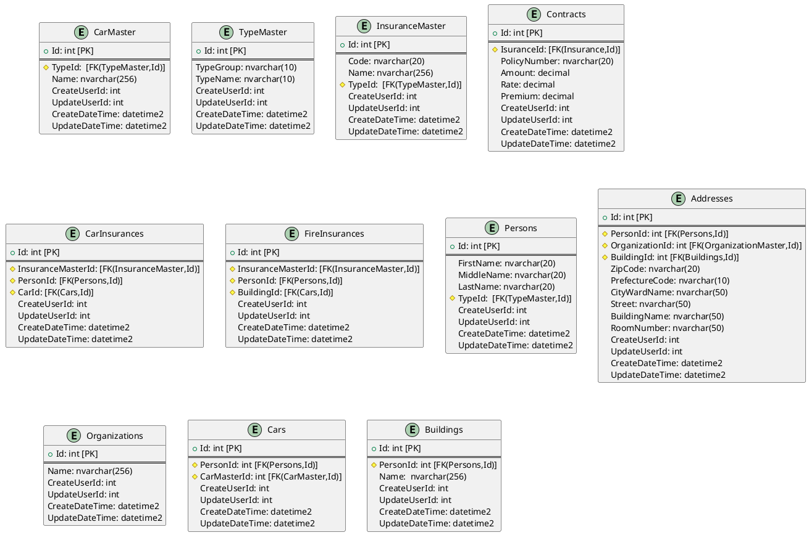

Contract ER

```puml
@startuml
entity "CarMaster" {
    + Id: int [PK]
    ==
     # TypeId:  [FK(TypeMaster,Id)]
    Name: nvarchar(256)
    CreateUserId: int
    UpdateUserId: int
    CreateDateTime: datetime2
    UpdateDateTime: datetime2
}

entity "TypeMaster" {
    + Id: int [PK]
    ==
    TypeGroup: nvarchar(10)
    TypeName: nvarchar(10)
    CreateUserId: int
    UpdateUserId: int
    CreateDateTime: datetime2
    UpdateDateTime: datetime2
}

entity "InsuranceMaster" {
    + Id: int [PK]
    ==
    Code: nvarchar(20)
    Name: nvarchar(256)
    # TypeId:  [FK(TypeMaster,Id)]
    CreateUserId: int
    UpdateUserId: int
    CreateDateTime: datetime2
    UpdateDateTime: datetime2
}

entity "Contracts" {
    + Id: int [PK]
    ==
    # IsuranceId: [FK(Insurance,Id)]
    PolicyNumber: nvarchar(20)
    Amount: decimal
    Rate: decimal
    Premium: decimal
    CreateUserId: int
    UpdateUserId: int
    CreateDateTime: datetime2
    UpdateDateTime: datetime2
}

entity "CarInsurances" {
    + Id: int [PK]
    ==
    # InsuranceMasterId: [FK(InsuranceMaster,Id)]
    # PersonId: [FK(Persons,Id)]
    # CarId: [FK(Cars,Id)]
    CreateUserId: int
    UpdateUserId: int
    CreateDateTime: datetime2
    UpdateDateTime: datetime2
}

entity "FireInsurances" {
    + Id: int [PK]
    ==
    # InsuranceMasterId: [FK(InsuranceMaster,Id)]
    # PersonId: [FK(Persons,Id)]
    # BuildingId: [FK(Cars,Id)]
    CreateUserId: int
    UpdateUserId: int
    CreateDateTime: datetime2
    UpdateDateTime: datetime2
}


entity "Persons" {
    + Id: int [PK]
    ==
    FirstName: nvarchar(20)
    MiddleName: nvarchar(20)
    LastName: nvarchar(20)
    # TypeId:  [FK(TypeMaster,Id)]
    CreateUserId: int
    UpdateUserId: int
    CreateDateTime: datetime2
    UpdateDateTime: datetime2
}

entity "Addresses" {
    + Id: int [PK]
    ==
    # PersonId: int [FK(Persons,Id)]
    # OrganizationId: int [FK(OrganizationMaster,Id)]
    # BuildingId: int [FK(Buildings,Id)]
    ZipCode: nvarchar(20)
    PrefectureCode: nvarchar(10)
    CityWardName: nvarchar(50)
    Street: nvarchar(50)
    BuildingName: nvarchar(50)
    RoomNumber: nvarchar(50)
    CreateUserId: int
    UpdateUserId: int
    CreateDateTime: datetime2
    UpdateDateTime: datetime2
}

entity "Organizations" {
    + Id: int [PK]
    ==
    Name: nvarchar(256)
    CreateUserId: int
    UpdateUserId: int
    CreateDateTime: datetime2
    UpdateDateTime: datetime2
}

entity "Cars" {
    + Id: int [PK]
    ==
    # PersonId: int [FK(Persons,Id)]
    # CarMasterId: int [FK(CarMaster,Id)]
    CreateUserId: int
    UpdateUserId: int
    CreateDateTime: datetime2
    UpdateDateTime: datetime2
}

entity "Buildings" {
    + Id: int [PK]
    ==
    # PersonId: int [FK(Persons,Id)]
    Name:  nvarchar(256)
    CreateUserId: int
    UpdateUserId: int
    CreateDateTime: datetime2
    UpdateDateTime: datetime2
}


@enduml
```
