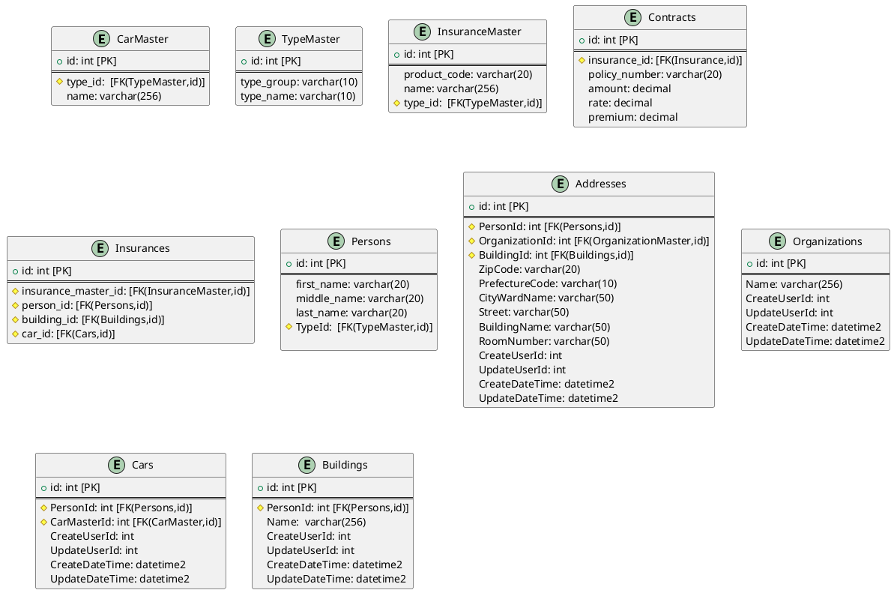

Contract ER

```puml
@startuml
entity "CarMaster" {
    + id: int [PK]
    ==
     # type_id:  [FK(TypeMaster,id)]
    name: varchar(256)
}

entity "TypeMaster" {
    + id: int [PK]
    ==
    type_group: varchar(10)
    type_name: varchar(10)
}

entity "InsuranceMaster" {
    + id: int [PK]
    ==
    product_code: varchar(20)
    name: varchar(256)
    # type_id:  [FK(TypeMaster,id)]
}

entity "Contracts" {
    + id: int [PK]
    ==
    # insurance_id: [FK(Insurance,id)]
    policy_number: varchar(20)
    amount: decimal
    rate: decimal
    premium: decimal
}

entity "Insurances" {
    + id: int [PK]
    ==
    # insurance_master_id: [FK(InsuranceMaster,id)]
    # person_id: [FK(Persons,id)]
    # building_id: [FK(Buildings,id)]
    # car_id: [FK(Cars,id)]
}


entity "Persons" {
    + id: int [PK]
    ==
    first_name: varchar(20)
    middle_name: varchar(20)
    last_name: varchar(20)
    # TypeId:  [FK(TypeMaster,id)]

}

entity "Addresses" {
    + id: int [PK]
    ==
    # PersonId: int [FK(Persons,id)]
    # OrganizationId: int [FK(OrganizationMaster,id)]
    # BuildingId: int [FK(Buildings,id)]
    ZipCode: varchar(20)
    PrefectureCode: varchar(10)
    CityWardName: varchar(50)
    Street: varchar(50)
    BuildingName: varchar(50)
    RoomNumber: varchar(50)
    CreateUserId: int
    UpdateUserId: int
    CreateDateTime: datetime2
    UpdateDateTime: datetime2
}

entity "Organizations" {
    + id: int [PK]
    ==
    Name: varchar(256)
    CreateUserId: int
    UpdateUserId: int
    CreateDateTime: datetime2
    UpdateDateTime: datetime2
}

entity "Cars" {
    + id: int [PK]
    ==
    # PersonId: int [FK(Persons,id)]
    # CarMasterId: int [FK(CarMaster,id)]
    CreateUserId: int
    UpdateUserId: int
    CreateDateTime: datetime2
    UpdateDateTime: datetime2
}

entity "Buildings" {
    + id: int [PK]
    ==
    # PersonId: int [FK(Persons,id)]
    Name:  varchar(256)
    CreateUserId: int
    UpdateUserId: int
    CreateDateTime: datetime2
    UpdateDateTime: datetime2
}


@enduml
```
