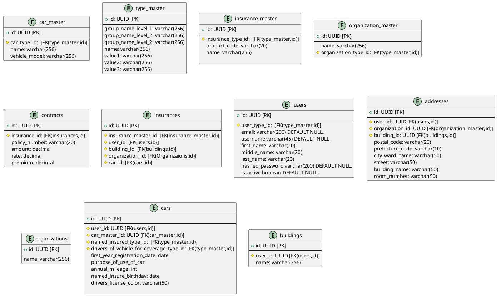

Contract ERcar_master

```puml
@startuml
entity "car_master" {
    + id: UUID [PK]
    ==
     # car_type_id:  [FK(type_master,id)]
    name: varchar(256)
    vehicle_model: varchar(256)
}

entity "type_master" {
    + id: UUID [PK]
    ==
    group_name_level_1: varchar(256)
    group_name_level_2: varchar(256)
    group_name_level_2: varchar(256)
    name: varchar(256)
    value1: varchar(256)
    value2: varchar(256)
    value3: varchar(256)
}

entity "insurance_master" {
    + id: UUID [PK]
    ==
    # insurance_type_id:  [FK(type_master,id)]
    product_code: varchar(20)
    name: varchar(256)

}

entity "organization_master" {
    + id: UUID [PK]
    ==
    name: varchar(256)
    # organization_type_id: [FK(type_master,id)]
}

entity "contracts" {
    + id: UUID [PK]
    ==
    # insurance_id: [FK(insurances,id)]
    policy_number: varchar(20)
    amount: decimal
    rate: decimal
    premium: decimal
}

entity "insurances" {
    + id: UUID [PK]
    ==
    # insurance_master_id: [FK(insurance_master,id)]
    # user_id: [FK(users,id)]
    # building_id: [FK(buildings,id)]
    # organization_id: [FK(Organizaions,id)]
    # car_id: [FK(cars,id)]
}

entity "users" {
    + id: UUID [PK]
    ==
    # user_type_id:  [FK(type_master,id)]
    email: varchar(200) DEFAULT NULL,
    username varchar(45) DEFAULT NULL,
    first_name: varchar(20)
    middle_name: varchar(20)
    last_name: varchar(20)
    hashed_password varchar(200) DEFAULT NULL,
    is_active boolean DEFAULT NULL,
}

entity "addresses" {
    + id: UUID [PK]
    ==
    # user_id: UUID [FK(users,id)]
    # organization_id: UUID [FK(organization_master,id)]
    # building_id: UUID [FK(buildings,id)]
    postal_code: varchar(20)
    prefecture_code: varchar(10)
    city_ward_name: varchar(50)
    street: varchar(50)
    building_name: varchar(50)
    room_number: varchar(50)
}

entity "organizations" {
    + id: UUID [PK]
    ==
    name: varchar(256)
}

entity "cars" {
    + id: UUID [PK]
    ==
    # user_id: UUID [FK(users,id)]
    # car_master_id: UUID [FK(car_master,id)]
    # named_insured_type_id:  [FK(type_master,id)]
    # drivers_of_vehicle_for_coverage_type_id: [FK(type_master,id)]
    first_year_registration_date: date
    purpose_of_use_of_car
    annual_mileage: int
    named_insure_birthday: date
    drivers_license_color: varchar(50)

}

entity "buildings" {
    + id: UUID [PK]
    ==
    # user_id: UUID [FK(users,id)]
    name: varchar(256)
}


@enduml
```
